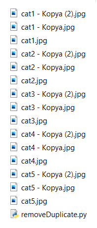
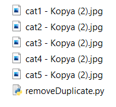

# Duplicate Remover

Duplicate Remover is a Python software created by using ImageHash and PIL libraries, and removes the same pictures given the file path. 

## Installation

To run this project first you have to install;
 - ImageHash
 - Python Image Library (PIL)

Then you have to change the file path in the `removeDuplicate.py` to your pictures folder that you want to remove same pictures.

    path = "" #You must change here.

## Usage

This is my folder filled with copy of 5 picture;

and when i run the `removeDuplicate.py` software, it's automatically deletes the copy of images and keeps only the last photo added. Like this;

  
## Info

It's only works with `.png .jpg and .jpeg` type of files. If you want it to support more file types, change the if statement on line 10 as you wish.

    if file.endswith(".png") or file.endswith(".jpg") or file.endswith(".jpeg"): 
